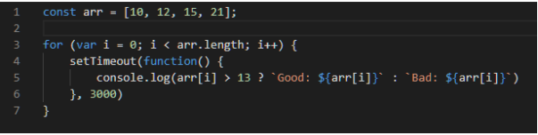

данный код выведет следующий результат:

Чтобы исправить данный код, мы можем изменить объявление переменной с var на let:

У нас будет следующий результат:

Или же мы можем сделать следующим образом:

Оба предложенных варианта основываются на создании переменной с локальной областью видимости и новой привязкой при каждой итерации.
